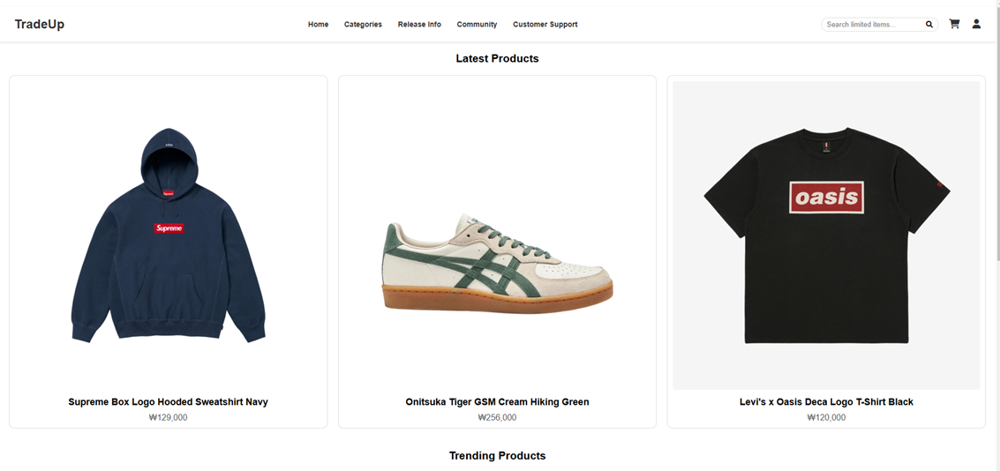
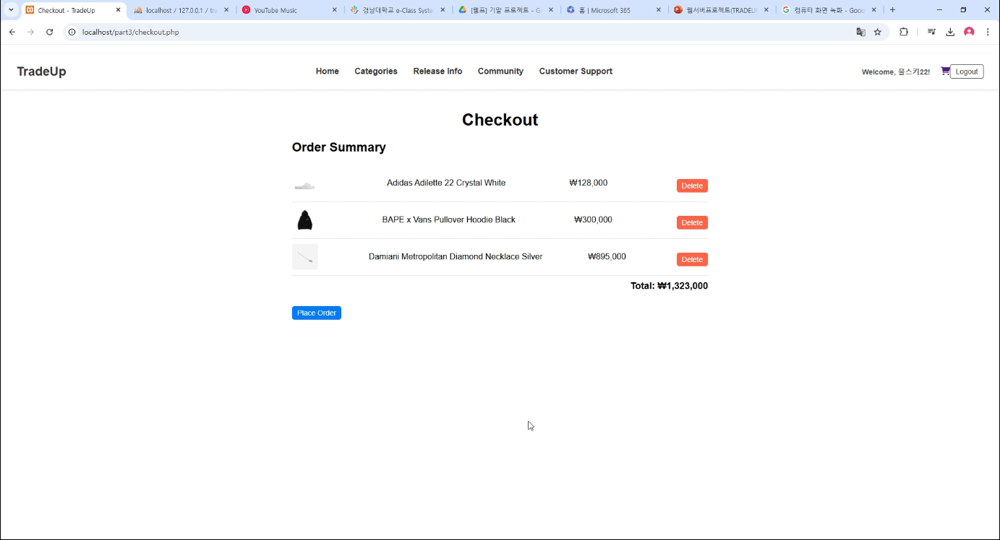
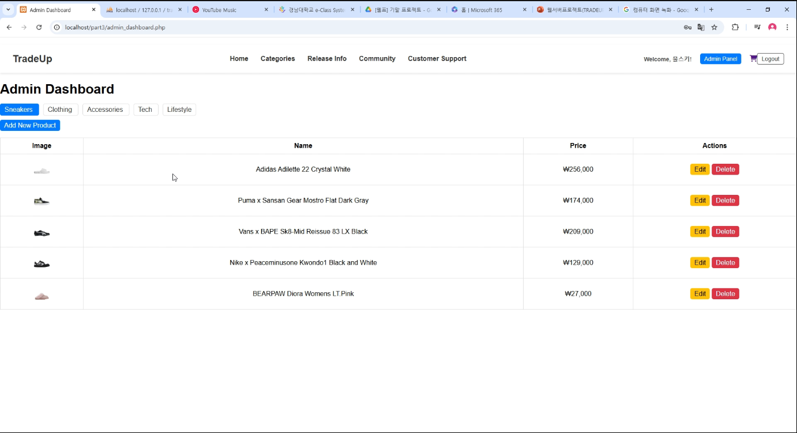
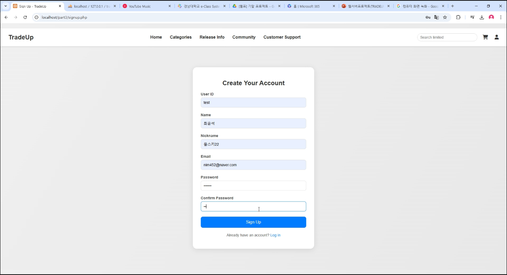
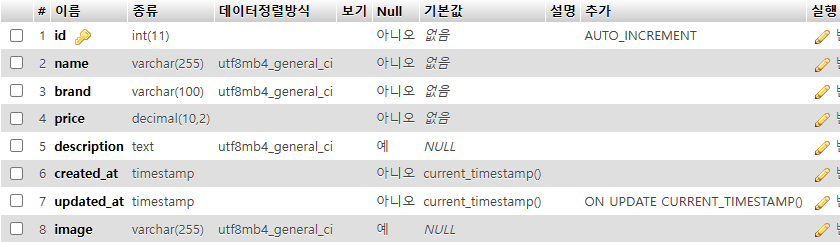
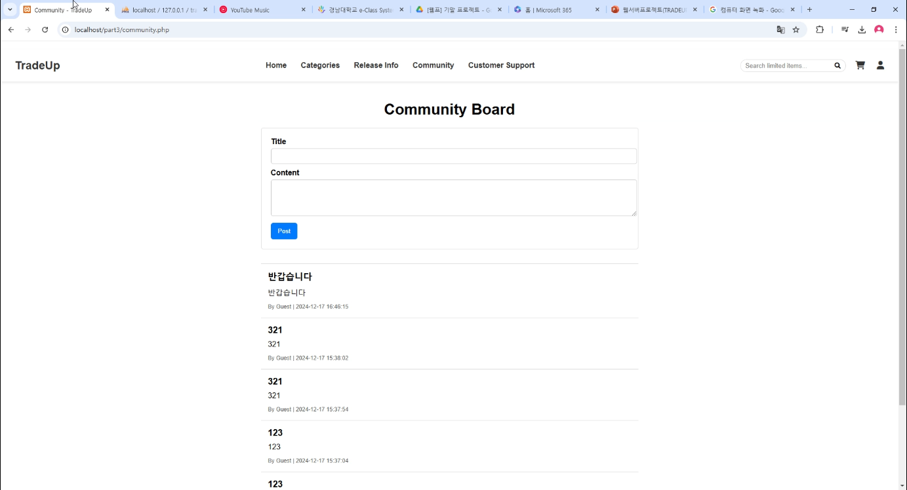

# 💼 TradeUP

**TradeUP**은 사용자 간의 중고 물품 거래를 지원하는 **웹 기반 거래 플랫폼**입니다.  
간편한 등록, 검색, 거래 기능을 통해 누구나 쉽게 상품을 사고팔 수 있습니다.

## 🖥️ 프로젝트 개요

- 🧩 **개발 환경**: XAMPP (Apache + MySQL)
- 🛠️ **구현 방식**: PHP 기반 웹 개발
- 🗃️ **데이터베이스**: MySQL
- 🎯 **주요 기능**:
  - 사용자 회원가입 및 로그인
  - 상품 등록, 검색, 조회
  - 거래 요청 및 상태 관리
  - 사용자 간 메시지 기능 (선택적)

---

## ⚙️ 기술 스택

| 구성 요소      | 사용 기술                |
|----------------|--------------------------|
| 백엔드         | PHP, MySQL               |
| 프론트엔드     | HTML, CSS, JavaScript    |
| 서버           | Apache (XAMPP)           |
| 데이터베이스    | MySQL                    |

---

## 📦 설치 및 실행 방법

1. **XAMPP 설치**  
   [XAMPP 공식 사이트](https://www.apachefriends.org/index.html)에서 다운로드 후 설치합니다.

2. **프로젝트 파일 복사**  
   TradeUP 프로젝트 폴더를 `htdocs` 디렉터리에 복사합니다.  
   예시:  C:/xampp/htdocs/part3

3. **MySQL 데이터베이스 설정**  
- XAMPP Control Panel에서 Apache와 MySQL 실행  
- `phpMyAdmin` 접속 후 데이터베이스 생성  
- `tradeup.sql` 등의 초기 스크립트를 실행해 테이블 생성

4. **사이트 실행**  
main.php를 웹브라우저에서 실행시켜 메인화면에 접속합니다.  

---
## 🌄 화면 미리보기

TradeUP의 주요 화면들을 아래에서 확인하실 수 있습니다.

<table>
  <tr>
    <td align="center"><b>🏠 메인 페이지</b></td>
    <td align="center"><b>🔍 장바구니</b></td>
  </tr>
  <tr>
    <td></td>
    <td></td>
  </tr>
  <tr>
    <td align="center"><b>📄 관리자계정페이지</b></td>
    <td align="center"><b>➕ 회원가입</b></td>
  </tr>
  <tr>
    <td></td>
    <td></td>
  </tr>
  <tr>
    <td align="center"><b>🔐 DB</b></td>
    <td align="center"><b>🙋 유저게시판</b></td>
  </tr>
  <tr>
    <td></td>
    <td></td>
  </tr>
</table>

---

## 📌 향후 개선 방향

- 거래 후기 및 별점 기능 추가
- 관리자 페이지 기능 고도화
- 모바일 반응형 UI 적용
- 실시간 채팅 기능 연동

---

## 📮 문의

개발자: **최윤석**  
이메일: `nim451@naver.com`

---

